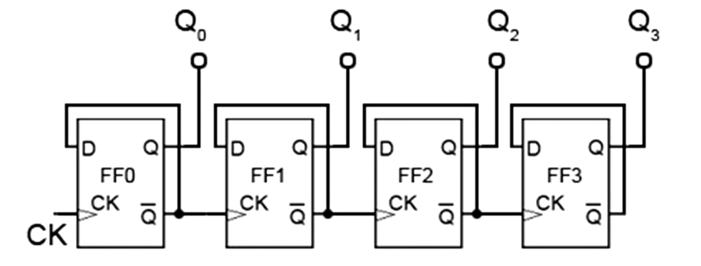

## Sekvencijalne mreže 

### Primer: D flip-flop

Sledeći primer prikazuje osnovni D flip-flop koji čuva ulaznu vrednost na pozitivnu granu takta (rising edge):

```verilog
// D flip-flop
module d_flipflop(
    input logic clk,      // Takt signal
    input logic d,        // Ulazni podatak
    output logic q        // Izlazni signal
);

    always @(posedge clk) begin
        q <= d;  // Dodela koja se aktivira na signal takta
    end
    
endmodule
```

Tipovi always bloka (*proces*) 
su: 
- `always_ff` - podrazumevano sekvancijalni blok sa izlazom koji je registar
- `always_comb` - podrazumevano 
kombinacioni blok sa izlazom koji **nije** 
registar. 
- `always_latch` - podrazumevano očekivani latch u bloku. 

Konstrukti kao takvi **ne sprečavaju**
pogrešnu sintezu, ali će se 
korisniku skrenuti pažnja ukoliko 
dolazi do greške. 


### Primer: D flip-flop sa sinhronim resetom 

```verilog
module d_flipflop_async_reset(
        input logic clk,      // Takt signal
        input logic d,        // Ulazni podatak
        output logic q        // Izlazni signal
    );

    always_ff @(posedge clk) begin
        if (~rst_n)
            q <= 0;
        else
            q <= d;
    end

endmodule
```


### Primer: D flip-flop sa asinhronim resetom

```verilog
module d_flipflop_async_reset(
        input logic clk,      // Takt signal
        input logic d,        // Ulazni podatak
        output logic q        // Izlazni signal
    );

    always_ff @(posedge clk or negedge rst_n) begin
        if (~rst_n)
            q <= 0;
        else
            q <= d;
    end

endmodule
```

**Objašnjenje:**

- `input logic clk` - Takt signal koji pokretanjem diktira kada se menja stanje flip-flopa
- `input logic d` - Ulazni podatak koji će biti pohranjen na usponsku ivicu signala
takta
- `output logic q` - Izlazni signal koji čuva poslednju sačuvanu vrednost
- `always @(posedge clk)` - Blok koji se aktivira na pozitivnu granu takta (rising edge)
- `q <= d;` - Ne-blokiranje dodela (`<=`) koja se koristi u sekvencijalnoj logici
- Razlika između `=` (blokiranje) i `<=` (ne-blokiranje): `<=` se koristi u `always @(posedge)` blokovima

#### Veoma važno razlika između `<=` i `=` dodela. 

`<=` operator se koristi u sekvencijalnoj logici jer omogućava sinhronizaciju sa taktom, za razliku od `assign` i `=` koji se koriste u kombinacionoj logici.

#### Na primer

Šift registar, može da bude ozbiljan
problem ukoliko se ne vodi računa. 

```verilog
module shift_demo (
  input  logic clk,
  input  logic d,
  output logic nb1, nb2,  // non-blocking: real shift
  output logic b1,  b2   // blocking: no shift
);

  // NE-BLOKIRAJUCE - svaki stepen čuva prethodnu vrednost
  always @(posedge clk) begin
    nb1 <= d;
    nb2 <= nb1;
  end

  // BLOCKING - b2 je uvek jednako d. 
  always @(posedge clk) begin
    b1 = d;
    b2 = b1;
  end

endmodule
```


### Primer: Brojač

```verilog
module counter #(
      parameter int N = 8
  ) (
      input  logic clk,
      input  logic rst_n,    // active-low synchronous reset
      output logic [N-1:0] count
  );

  always_ff @(posedge clk) begin
      if (~rst_n)
          count <= '0;  
      else 
          count <= count + 1'b1;
  end

endmodule
```
### Primer T-flip flop 

Flip flop koji na svaki impuls takta menja svoje stanje 
ako je _T=1_ a zadržava isto stanje ako je _T=0_. 


### Primer ripple counter

Na slici je prikazan _ripple counter_ realizovan samo sa 
D-flip flopovima. 



Opis:

```verilog
// Single toggle flip-flop primitive (D tied to Q̄ internally)
module tff (
    input  logic clk,
    output logic q,
    output logic q_n
);
    initial begin
        q   = 1'b0;
        q_n = 1'b1;
    end

    always_ff @(posedge clk) begin
        q   <= ~q;
        q_n <= q;
    end
endmodule


// Ripple counter: instantiates N toggle FFs in a chain
module ripple_counter #(
    parameter int N = 4
) (
    input  logic clk,
    output logic [N-1:0] q
);

    logic [N-1:0] q_n;

    genvar i;
    generate
        for (i = 0; i < N; i++) begin : g_ff
            tff u_ff (
                .clk (i == 0 ? clk    : q_n[i-1]),
                .q   (q[i]),
                .q_n (q_n[i])
            );
        end
    endgenerate

endmodule
```


## Mašina stanja - Kontroler semafora

Modul `traffic_light` implementira kontroler semafora kao konačni automat (FSM) sa tri stanja — zeleno, žuto i crveno — kroz koja ciklično prolazi na osnovu internog brojača taktova, pri čemu trajanje svakog stanja može biti nezavisno podešeno parametrima `GREEN_TICKS`, `AMBER_TICKS` i `RED_TICKS`, a izlazi `green`, `amber` i `red` direktno odražavaju trenutno aktivno stanje (Murov automat), dok asinhroni reset signalom `rst_n` vraća sistem u početno zeleno stanje.

```verilog
module traffic_light #(
    parameter int GREEN_TICKS = 10,
    parameter int AMBER_TICKS = 3,
    parameter int RED_TICKS   = 8
) (
    input  logic clk,
    input  logic rst_n,
    output logic red,
    output logic amber,
    output logic green
);

    // -------------------------------------------------------
    // Kodiranje stanja, typedef enum (C sintaksa)
    // -------------------------------------------------------
    typedef enum logic [1:0] {
        GREEN = 2'b00,
        AMBER = 2'b01,
        RED   = 2'b10
    } state_t;

    state_t state, next_state;

    // -------------------------------------------------------
    // Tajmer 
    // -------------------------------------------------------
    localparam int MAX_TICKS = GREEN_TICKS;  // largest value
    logic [$clog2(MAX_TICKS+1)-1:0] timer;
    logic timer_done;

    always_ff @(posedge clk or negedge rst_n) begin
        if (!rst_n)
            timer <= '0;
        else if (timer_done)
            timer <= '0;
        else
            timer <= timer + 1'b1;
    end

    // -------------------------------------------------------
    // Trenutno stanje  (sekvencijalno)
    // -------------------------------------------------------
    always_ff @(posedge clk or negedge rst_n) begin
        if (!rst_n)
            state <= GREEN;
        else if (timer_done)
            state <= next_state;
    end

    // -------------------------------------------------------
    // Logika narednog stanja  (kombinaciono)
    // -------------------------------------------------------
    always_comb begin
        case (state)
            GREEN:   begin next_state = AMBER; timer_done = (timer == GREEN_TICKS - 1); end
            AMBER:   begin next_state = RED;   timer_done = (timer == AMBER_TICKS - 1); end
            RED:     begin next_state = GREEN; timer_done = (timer == RED_TICKS   - 1); end
            default: begin next_state = GREEN; timer_done = 1'b0;                       end
        endcase
    end

    // -------------------------------------------------------
    // Izlazna logika
    // -------------------------------------------------------
    always_comb begin
        red   = (state == RED);
        amber = (state == AMBER);
        green = (state == GREEN);
    end

endmodule
```