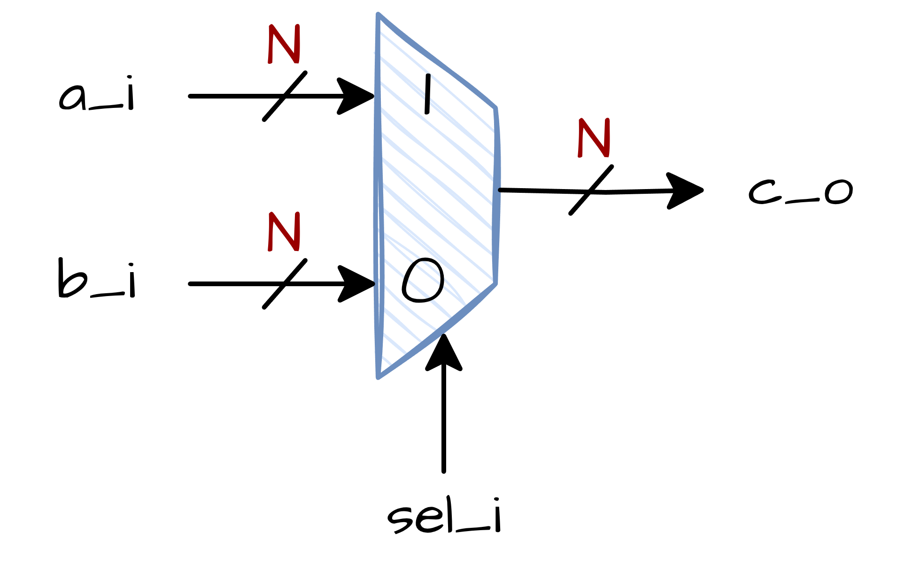

# 2:1 Multiplekser (MUX)
## 📘 Šta je Multiplekser?
**Multiplekser (MUX)** je digitalno kolo koje bira jedan od više ulaznih signala i prosleđuje ga na jedan izlaz.
Funkcioniše kao **selektor podataka** — na osnovu **upravljačkog signala** (poznatog i kao linija za selekciju), MUX bira koji ulaz se šalje na izlaz.

**2:1 multiplekser** ima:
- **2 ulaza**: `a`, `b`
- **1 liniju za selekciju**: `sel`
- **1 izlaz**: `c`

---
## ⚙️ Kako Radi
Rad 2u1 MUX-a može se definisati sledećom tabelom istinitosti:

| **sel** | **Izlaz (c)** |
|---------|----------------|
| 0       | b              |
| 1       | a              |

- Ako je **signal za selekciju** (`sel`) jednak `0`, izlaz će biti jednak ulazu `b`.
- Ako je **signal za selekciju** (`sel`) jednak `1`, izlaz će biti jednak ulazu `a`.

## 🔲 Blok Dijagram
Ispod se nalazi blok dijagram 2:1 multipleksera:

<div align="center">

</div>

## 💻 Zadatak
Vaš zadatak je da napišete **parametrizovanu implementaciju** mux-a 2:1 u SystemVerilog-u koristeći dati interfejs.
Parametar `N` omogućava multiplekseru da radi sa proizvoljnom širinom podataka u bitovima (npr. 1-bitni, 8-bitni, 16-bitni, itd.).


Priloženi templejt modul se nalazi u folderu
**rtl**. a kompletan testbench napisan je u folderu **dv**.
Da bi testbench ispravno radio neophodno je da imena 
portova i parametara modula bude kako je specificirano!


## 🛠️ Kako Pokrenuti
Koristite priloženi **Makefile** za kompajliranje, pokretanje i analizu projekta. Da biste se 
upoznali sa pisanjem testbench fajla pročitajtajte napisani 
testbench uz ovaj zadatak.

### 1. Pokretanje Verilator Lintera
Proverite dizajn modul na lint greške:
```bash
make lint_dut
```
Proverite testbench fajl na lint greške:
```bash
make lint_tb
```
### 2. Pokretanje Testbench-a
Kompajlirajte i pokrenite testbench:
```bash
make all
```
### 3. Čišćenje Foldera
Uklonite sve fajlove nastale kompajliranjem i simulacijom:
```bash
make clean
```