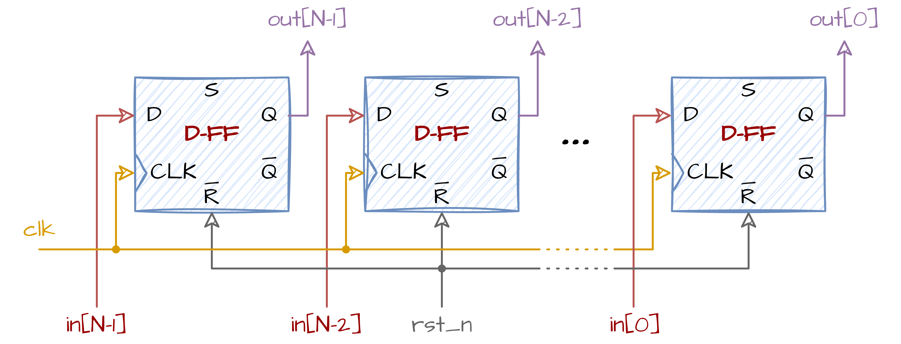

# Jednostavan Registar (D Flip-Flop sa Resetom)
## 📘 Šta je Registar?
**Registar** je osnovni element za skladištenje podataka u digitalnoj elektronici. Čuva vrednost na usponskoj (obično) ivici taktnog signala i zadržava je do sledećeg taktnog događaja. Registri su izgrađeni od **flip-flopova**, tipično **D-tipa flip-flopova**.

Registar je neophodan za:
- Čuvanje međuvrednosti u procesorima
- Zadržavanje podataka u cevovodima (pipeline)
- Sinhronizaciju signala između taktnih domena
- itd.

## ⚙️ Kako Radi
Jednostavan registar ima:
- **Taktni ulaz (`clk_i`)** — podaci se uzorkuju na rastućoj ivici takta.
- **Ulaz za reset (`rst_ni`)** — asinhroni, aktivno-niski reset, briše registar na `0`.
- **Ulaz podataka (`data_i`)** — vrednost koja se čuva.
- **Izlaz podataka (`data_o`)** — sačuvana vrednost, osvežava se svakim taktnim ciklusom.

\*Signali registra mogu imati različita imena. Ovo su nazivi koje ćemo koristiti.

## 🔲 Blok Dijagram
Ispod se nalazi blok dijagram N-bitnog registra:

<div align="center">

</div>

## 💻 Implementacija u SystemVerilog-u
Vaš zadatak je da napišete **parametrizovanu implementaciju** jednostavnog registra u SystemVerilog-u koristeći dati interfejs.
Parametar `N` menja širinu registra.

```verilog
module simpleRegister 
  # (
parameter int N = 8
  ) (
input  logic         clk_i,
input  logic         rst_ni,
input  logic [N-1:0] data_i,
output logic [N-1:0] data_o
);
// Vaš kod ovde
endmodule
```

Priloženi modul se nalazi u folderu **rtl**, a testbench u folderu **dv**.

## 🛠️ Kako Pokrenuti
Koristite priloženi **Makefile** za kompajliranje, pokretanje i analizu projekta.

### 1. Pokretanje Verilator Lintera
Proverite dizajn modul na lint greške:
```bash
make lint_dut
```
Proverite testbench fajl na lint greške:
```bash
make lint_tb
```
### 2. Pokretanje Testbench-a
Kompajlirajte i pokrenite testbench:
```bash
make all
```
### 3. Čišćenje Foldera
Uklonite sve fajlove nastale kompajliranjem i simulacijom:
```bash
make clean
```