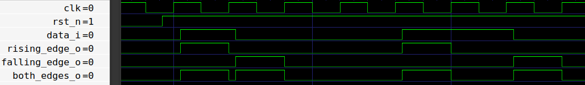

# Detektor Ivice 
## 📘 Uvod
**Detektor ivice** (_Edge detector_) je digitalno kolo koje se koristi za prepoznavanje promena (prelaza) u signalu. Umesto neprekidnog praćenja da li je signal `0` ili `1`, detektor ivice daje **impuls** svaki put kada ulaz promeni stanje.

Postoje tri uobičajene vrste detekcije ivice:
- **Rastuća ivica** – detektuje prelaz `0` → `1`
- **Padajuća ivica** – detektuje prelaz `1` → `0`
- **Obe ivice** – detektuje **bilo kakvu promenu** (`0` → `1` ili `1` → `0`)

Ovi izlazi našeg detektora ivice biće **aktivni** kada dođe do ivice, a zatim **deaktivirani na sledećoj rastućoj ivici takta** ako ne dođe do novog prelaza.

## ⚙️ Kako Radi
Osnovna ideja je da se **trenutni ulazni signal** poredi sa **odloženom verzijom** samog sebe:
- Ako je odloženi signal = `0` i ulaz = `1` → **Detektovana rastuća ivica**
- Ako je odloženi signal = `1` i ulaz = `0` → **Detektovana padajuća ivica**
- Ako odloženi signal ≠ ulaz → **Detektovana bilo koja ivica**

Ovo zahteva čuvanje prethodne vrednosti ulaza u **registru (flip-flopu)** i njeno poređenje sa trenutnom vrednošću.

## 🔲 Primer Dijagrama
Ispod se nalazi blok dijagram N-bitnog registra:

<div align="center">

</div>

## 💻 Implementacija u SystemVerilog-u
Vaš zadatak je da napišete **implementaciju** detektora ivice (rastuća, padajuća, obe ivice) u SystemVerilog-u koristeći dati interfejs.
Dok je `rst_ni` aktivan, svi izlazi treba da budu 0.

```verilog
module edge_detector (
  // Vaš kod ovde
  );

  // Vaš kod ovde
endmodule
```

Priloženi modul se nalazi u folderu **rtl**, a testbench u folderu **dv**.

## 🛠️ Kako Pokrenuti
Koristite priloženi **Makefile** za kompajliranje, pokretanje i analizu projekta.

### 1. Pokretanje Verilator Lintera
Proverite dizajn modul na lint greške:
```bash
make lint_dut
```
Proverite testbench fajl na lint greške:
```bash
make lint_tb
```
### 2. Pokretanje Testbench-a
Kompajlirajte i pokrenite testbench:
```bash
make all
```
### 3. Čišćenje Foldera
Uklonite sve fajlove nastale kompajliranjem i simulacijom:
```bash
make clean
```