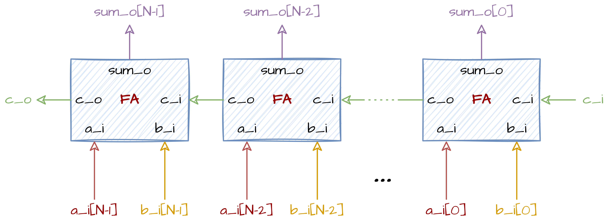

# N-bitni Sabirač s Prostiranjem Prenosa (RCA)
## 📘 Pregled
**N-bitni sabirač s prostiranjem prenosa** ulančava `N` jednobitnih **potpunih sabirača** kako bi sabrao dva N-bitna operanda sa opcionalnim prenosom na ulazu. Svaki potpuni sabirač proizvodi **bit sume** i **prenos na izlazu**, koji se *prostire* do sledećeg stepena (od LSB prema MSB).
- **Ulazi:**
  - `a_i[N-1:0]`, `b_i[N-1:0]`, operandi
  - `c_i`, prenos na ulazu
- **Izlazi:**
  - `sum_o[N-1:0]`, izlazna suma
  - `overflow_o`, konačni prenos na izlazu
- **Zavisnost:** koristi prethodno definisani modul `full_adder`.
---
## ⚙️ Kako Radi
Za svaku bitsku poziciju `i` (od 0 do `N-1`):
- `sum_o[i] = a_i[i] ⊕ b_i[i] ⊕ carry[i]`
- `carry[i+1] = (a_i[i] · b_i[i]) + (carry[i] · (a_i[i] ⊕ b_i[i]))`
Početni prenos je `carry[0] = c_i`, a konačni prenos na izlazu je `overflow_o = carry[N]`.
**Napomena o vremenu propagacije:** Sabirači s prostiranjem prenosa su jednostavni i efikasni po površini, ali kašnjenje u najgorem slučaju raste linearno sa `N`, jer svaki stepen čeka prenos iz prethodnog.
## 🔲 Blok Dijagram
Ispod se nalazi blok dijagram N-bitnog RCA:
<div align="center">

</div>
Imajte na umu da `overflow_o` morate generisati sami, pošto nije prikazan u blok dijagramu.

## 💻 Implementacija u SystemVerilog-u
Vaš zadatak je da napišete **parametrizovanu implementaciju** **N-bitnog sabirača s prostiranjem prenosa** u SystemVerilog-u koristeći dati interfejs. Molimo koristite prethodno urađeni modul **full_adder**.
```verilog
module adder_N # (
  parameter int N = 8
    ) (
  input  [N-1:0] a_i,
  input  [N-1:0] b_i,
  input          c_i,
  output [N-1:0] sum_o,
  output         overflow_o
  );

  // Vaš kod ovde
endmodule
```
Dati modul se nalazi u folderu **rtl**, a testbench je u folderu **dv**.
## 🛠️ Kako Pokrenuti
Koristite priloženi **Makefile** za izgradnju, pokretanje i proveru projekta.
### 1. Pokretanje Verilator lintera
Proverite dizajn modul na greške:
```bash
make lint_dut
```
Proverite testbench fajl na greške:
```bash
make lint_tb
```
### 2. Pokretanje Testbench-a
Kompajlirajte i pokrenite testbench:
```bash
make all
```
### 3. Čišćenje Foldera
Uklonite sve fajlove izgradnje i simulacije:
```bash
make clean
```