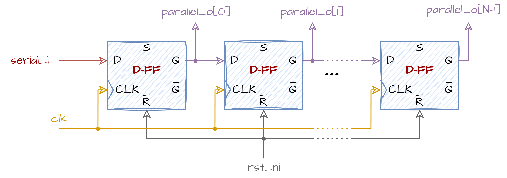

# Pomerački Registar (Serijski Ulaz / Paralelni Izlaz - SIPO)
## 📘 Pregled
**Pomerački registar** je sekvencijalno kolo koje pomera svoje uskladištene bitove za jednu poziciju na svakom taktu. Ovaj modul implementira **serijski ulaz / paralelni izlaz (SIPO)** pomerački registar sa:
- Parametrizabilnom širinom `N` (podrazumevano 8 bitova),
- **Asinhronim resetom aktivnim na niskom nivou**,
- **Omogućavanjem pomeranja**,
- Ponašanjem **pomeranja ulevo** pri čemu se `serial_i` pomera u **LSB**.
## ⚙️ Kako Radi
Na svakoj rastućoj ivici signala `clk_i`:
- Ako je `rst_ni == 0`: registar se resetuje na sve nule.
- U suprotnom, ako je `en_i == 1`: registar se **pomera ulevo za 1**; **LSB** (`[0]`) se učitava vrednošću `serial_i`.
## 🔲 Blok Dijagram
Ispod se nalazi blok dijagram N-bitnog Pomeračkog Registra:
<div align="center">

</div>

*Logika za omogućavanje pomeranja `en_i` nije prikazana.*
## 💻 Implementacija u SystemVerilog-u
Vaš zadatak je da napišete **parametrizovanu implementaciju** **pomeračkog registra** u SystemVerilog-u koristeći dati interfejs.
```verilog
module shift_register 
    # (
    parameter int N = 8
    ) (
    input  logic         clk_i,
    input  logic         rst_ni,    // asinhroni reset aktivan na niskom nivou
    input  logic         en_i,      // omogućavanje pomeranja
    input  logic         serial_i,  // serijski bit se pomera u LSB
    output logic [N-1:0] parallel_o // paralelni izlaz
    );
  
    // Vaš kod ovde
endmodule
```
Dati modul se nalazi u folderu **rtl**, a testbench je u folderu **dv**.
## 🛠️ Kako Pokrenuti
Koristite priloženi **Makefile** za izgradnju, pokretanje i proveru projekta.
### 1. Pokretanje Verilator lintera
Proverite dizajn modul na greške:
```bash
make lint_dut
```
Proverite testbench fajl na greške:
```bash
make lint_tb
```
### 2. Pokretanje Testbench-a
Kompajlirajte i pokrenite testbench:
```bash
make all
```
### 3. Čišćenje Foldera
Uklonite sve fajlove izgradnje i simulacije:
```bash
make clean
```